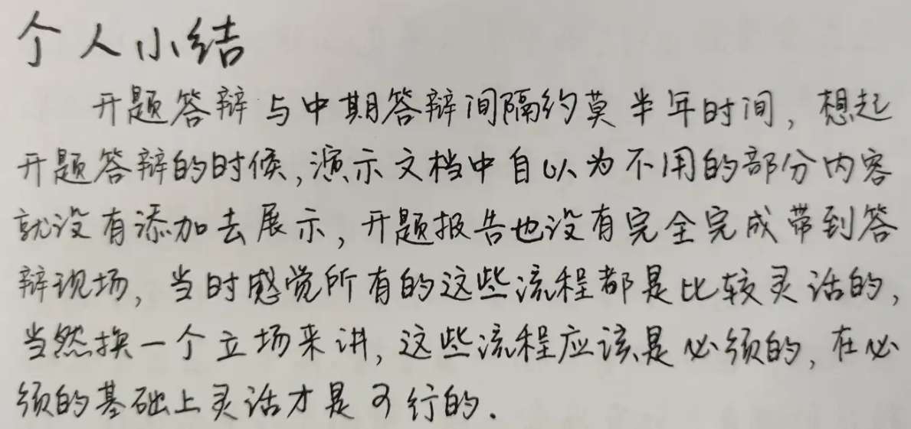

# 📝 Word 手写字体宏 | Handwriting Font Macro

[](https://www.microsoft.com/microsoft-365/word)
[](https://docs.microsoft.com/office/vba/api/overview/)

> ✨ 一个让 Word 文档"看起来像手写"的 VBA 宏，通过随机化字体、字号和排版参数，模拟真实手写效果。目前的版本是网络摘录所得（AI之前），现在可以使用AI来优化这个宏，使其更加智能和高效。

---

## 🎯 功能特性

| 特性 | 描述 |
|:---|:---|
| 🎲 **随机字体** | 在多种手写字体间智能切换 |
| 📐 **字号波动** | 模拟手写时的大小不一 |
| ↕️ **垂直偏移** | 模拟书写的上下起伏 |
| ↔️ **字距调整** | 模拟自然的手写间距 |
| 📏 **行距变化** | 每行间距略有不同 |
| 🎯 **智能识别** | 标点、数字、字母使用不同字体 |


## 🚀 快速开始

### 1️⃣ 安装字体

下载以下字体文件（TTF格式，开源免费）：

| 字体名称 | 用途 | 推荐场景 |
|:---|:---|:---|
| 【嵐】芊柔体 | 正文主要字体 | 汉字内容 |
| 萌妹子体 | 备选字体 | 可爱风格文档 |
| 张维镜手写楷书 | 标点专用 | 正式手写体 |

> 📥 **安装方式**：将 `.ttf` 文件复制到 `C:\Windows\Fonts` 即可完成安装

### 2️⃣ 添加宏到 Word

1. 打开 Microsoft Word
2. 按 `Alt + F11` 打开 VBA 编辑器
3. 插入 → 模块
4. 复制下方的宏代码
5. 保存并关闭 VBA 编辑器

<details>
<summary><b>宏代码</b></summary>

```
Sub 字体修改()
' 字体修改 宏

Dim R_Character As Range

' 字体大小在下列值之间进行波动，改成需要的大小，重复出现的次数越多，相应出现的概率越大，最小精度0.5
Dim FontSize() As String
FontSize = Split("18.5,18.5,18.5,19,18", ",")

'字体名称在下列字体之间进行波动，改成需要的字体，但需要保证系统拥有下列字体，可以在word查看字体名字
Dim FontName() As String
FontName = Split("【嵐】芊柔体,萌妹子体,张维镜手写楷书,【嵐】芊柔体", ",") 
' 推荐字体
' "萌妹子体,张维镜手写楷书,萌妹子体,汉仪晨妹子W,小豆岛风物诗简繁,小豆岛秋日和简繁"   

'a数值越大，行距越大，波动范围a+x, x∈[-1~1]
a = 0
'b数值越大，字距越大，波动范围b+x, x∈[-1~1]
b = 0
'行间距 在一定以下值中均等分布，改成需要的大小，范围c+x, x∈[0~5]
c = 25

For Each R_Character In ActiveDocument.Characters

VBA.Randomize
' 数组长度
FontNameLength = UBound(FontName) - LBound(FontName)
FontSizeLength = UBound(FontSize) - LBound(FontSize)

' 字号大小
R_Character.Font.Size = FontSize(Int(VBA.Rnd * FontSizeLength) + 1)
' 字的上下偏移
R_Character.Font.Position = Choose(Int(VBA.Rnd * 5) + 1, -1, -0.5, 0, 0.5, 1) + a
' 字的左右间距
R_Character.Font.Spacing = Choose(Int(VBA.Rnd * 5) + 1, -1, -0.5, 0, 0.5, 1) + b

If R_Character = "。" Or R_Character = "，" Or R_Character = "," Or R_Character = "；" Or R_Character = "’" Or R_Character = "‘" Or R_Character = "“" Or R_Character = "”" Or R_Character = "！" Or R_Character = "？" Or R_Character = "、" Or R_Character = "：" Then
' 中文常用标点符号
' 标点固定用以下字体
R_Character.Font.Name = "张维镜手写楷书"
' 标点随机用FontName中字体
'R_Character.Font.Name = FontName(Int(VBA.Rnd * FontSizeLength))
ElseIf Asc(R_Character) >= 48 And Asc(R_Character) <= 57 Then
' 数字
R_Character.Font.Name = "【嵐】芊柔体"
ElseIf Asc(R_Character) >= 97 And Asc(R_Character) <= 122 Or Asc(R_Character) >= 65 And Asc(R_Character) <= 90 Or R_Character = "." Or R_Character = "（" Or R_Character = "）" Or R_Character = "(" Or R_Character = ")" Then
' 大小写字母
R_Character.Font.Name = "【嵐】芊柔体"
End If

Next

For Each Cur_Paragraph In ActiveDocument.Paragraphs
' 设置行间距类型为固定值
Cur_Paragraph.LineSpacingRule = wdLineSpaceExactly
' 设置行间距的值
Cur_Paragraph.LineSpacing = Int(VBA.Rnd * 5) + 1 + c
Next

Selection.Find.ClearFormatting
Selection.Find.Replacement.ClearFormatting

With Selection.Find
.Text = "“"
.Replacement.Text = ""
.Forward = True
.Wrap = wdFindContinue
.Format = False
.MatchCase = False
.MatchWholeWord = False
.MatchByte = True
.MatchWildcards = False
.MatchSoundsLike = False
.MatchAllWordForms = False
End With

Selection.Find.Execute Replace:=wdReplaceAll
Selection.Find.ClearFormatting
Selection.Find.Replacement.ClearFormatting

With Selection.Find
.Text = "”"
.Replacement.Text = ""
.Forward = True
.Wrap = wdFindContinue
.Format = False
.MatchCase = False
.MatchWholeWord = False
.MatchByte = True
.MatchWildcards = False
.MatchSoundsLike = False
.MatchAllWordForms = False
End With

Selection.Find.Execute Replace:=wdReplaceAll

Application.ScreenUpdating = True

End Sub
```

</details>


### 3️⃣ 运行宏

- 按 `Alt + F8` 打开宏列表
- 选择 `字体修改`
- 点击"运行"


## ⚙️ 自定义配置

在代码中调整以下参数，打造专属手写风格：

```vba
' 🎨 字号配置（单位：磅 pt）
' 数值重复次数越多，出现概率越大，最小精度 0.5
FontSize = Split("18.5,18.5,18.5,19,18", ",")

' 🔤 字体配置（需确保系统已安装）
FontName = Split("【嵐】芊柔体,萌妹子体,张维镜手写楷书,【嵐】芊柔体", ",")

' 📐 排版微调参数
a = 0   ' 行距波动系数 (范围: a + [-1, 1])
b = 0   ' 字距波动系数 (范围: b + [-1, 1])
c = 25  ' 基础行间距   (范围: c + [0, 5])
```

### 💡 推荐字体组合

```vba
"萌妹子体,张维镜手写楷书,萌妹子体,汉仪晨妹子W,小豆岛风物诗简繁,小豆岛秋日和简繁"
```

---

## 🧠 智能字体分配逻辑

```
┌─────────────────┬──────────────────┐
│   字符类型       │     使用字体      │
├─────────────────┼──────────────────┤
│ 中文标点符号     │ 张维镜手写楷书    │
│ 数字 0-9        │ 【嵐】芊柔体      │
│ 英文大小写       │ 【嵐】芊柔体      │
│ 其他符号 () .    │ 【嵐】芊柔体      │
│ 普通汉字         │ FontName 随机     │
└─────────────────┴──────────────────┘
```

> 🎯 **特殊处理**：自动删除文档中的所有中文引号 `" "` 和 `" "`，模拟手写时更自然的排版


## 📸 效果预览

*使用本宏后，文档将呈现：*
- 字体大小不一（模拟用力不均）
- 字间距随机变化（模拟手写节奏）
- 上下位置轻微浮动（模拟书写基线不稳）
- 行距略有差异（模拟换行习惯）
  



## 🛠️ 技术细节

- **随机种子**：使用 `VBA.Randomize` 确保每次运行结果不同
- **性能优化**：`Application.ScreenUpdating = True` 确保界面响应
- **正则替换**：利用 `Selection.Find` 批量处理引号


## ⚠️ 注意事项

1. 🔤 **字体必须预先安装**，否则宏会使用默认字体
2. 💾 **建议先备份文档**，宏会直接修改当前文档
3. 🔄 **可多次运行**，每次生成不同的随机效果
4. 🌐 **仅支持 Windows 版 Word**（macOS 字体路径不同）


> 💬 **小贴士**：配合合适的纸张背景图片，打印效果以假乱真！