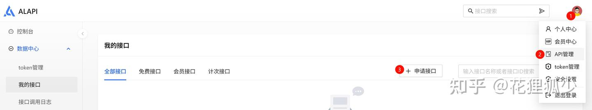
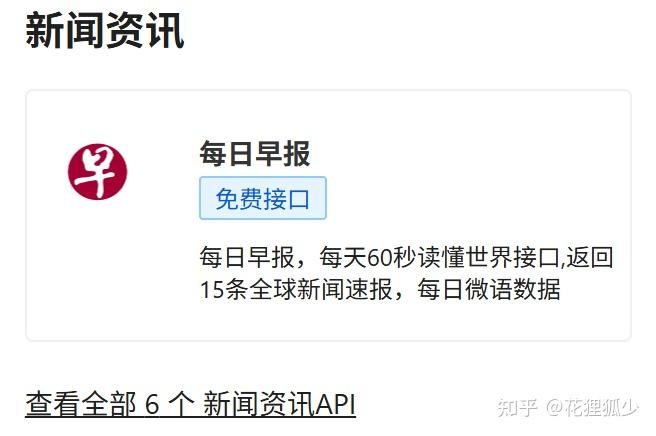
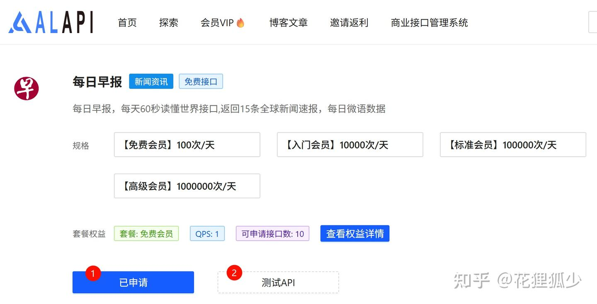
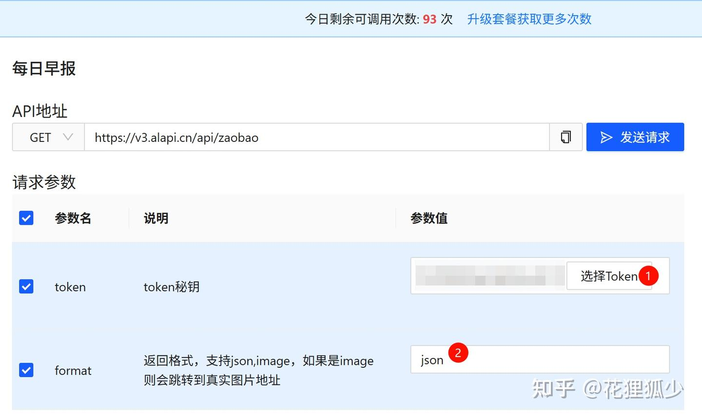
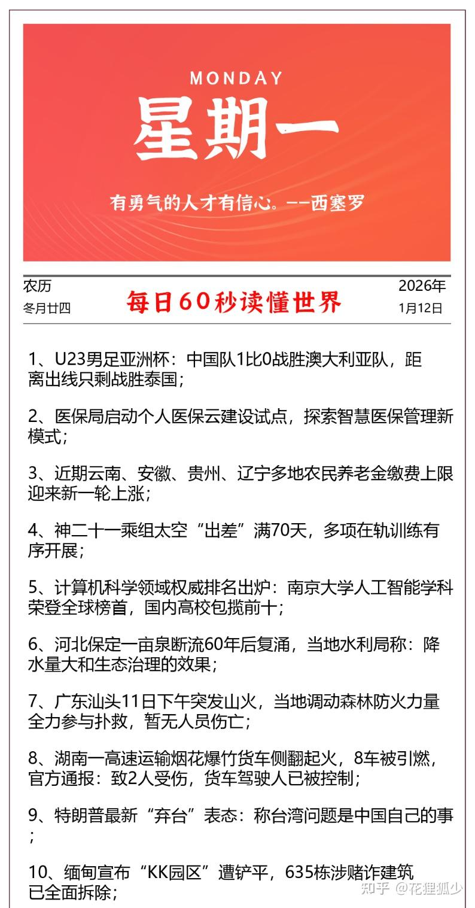
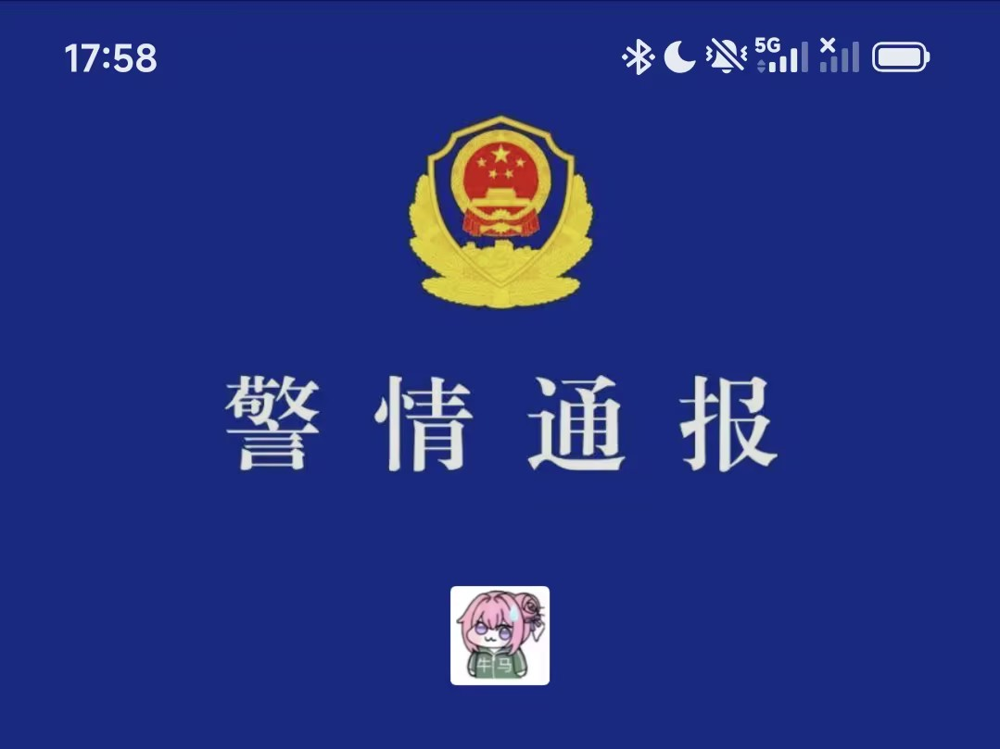

# ⏱️ 每日60s看世界 | Daily 60s World Briefing

[](https://www.alapi.cn/)


> ✨ “每天60秒读懂世界”将每日全球要闻精炼为 15 条短资讯 + 一条微语，帮助用户在通勤、间隙等碎片时间内快速建立对世界形势的认知。

---


原项目地址，github开源项目：
https://github.com/vikiboss/60s

不懂部署的同学可以按照下述给出的步骤来操作：
https://www.cnblogs.com/an-shiguang/p/18269047

此处给出一个简单版本：

1. 注册并登录ALAPI，个人中心→API管理→申请接口
   
    <!-- <div align="center">
        
    </div> -->
2. 找到“每日早报”，可免费调用
   
    <!-- <div align="center">
        
    </div> -->
3. 免费申请→（点击后变成“已申请”）→测试API
   
    <!-- <div align="center">
        
    </div> -->
4. 选择Token，如果没有新建一个并选择即可；json/image按需设置
   
    <!-- <div align="center">
        
    </div> -->
5. 本地新建一个html文件（可以新建一个txt文件，后将后缀txt修改为html），如60s.html，将下述内容复制进文件并保存。**必须将代码中的《替换为你的token》修改为ALAPI中创建的token**。
    ```html
    <!DOCTYPE html>
    <html lang="en">
    
    <head>
        <meta charset="UTF-8">
        <meta http-equiv="X-UA-Compatible" content="IE=edge">
        <meta name="viewport" content="width=device-width, initial-scale=1.0">
        <title>每日早报</title>
    </head>
    
    <body>
        <div style="text-align: center;">  </div>
    </body>
    
    </html>
    ```
6. 将该html文件使用浏览器打开即可。如果需要在手机上使用，将该文件使用微信或者云服务发送到手机端，然后手机浏览器打开，并选择添加到桌面，之后以app形式点击打开，即可“每日60s看世界”。
   
    <!-- <div align="center">
        
    </div> -->
7. 将60s.html添加到桌面书签时，建议将名称设置为“每日60s”，图标可以选择一个“合适”的图标。
   
    <!-- <div align="center">
        
    </div> -->
