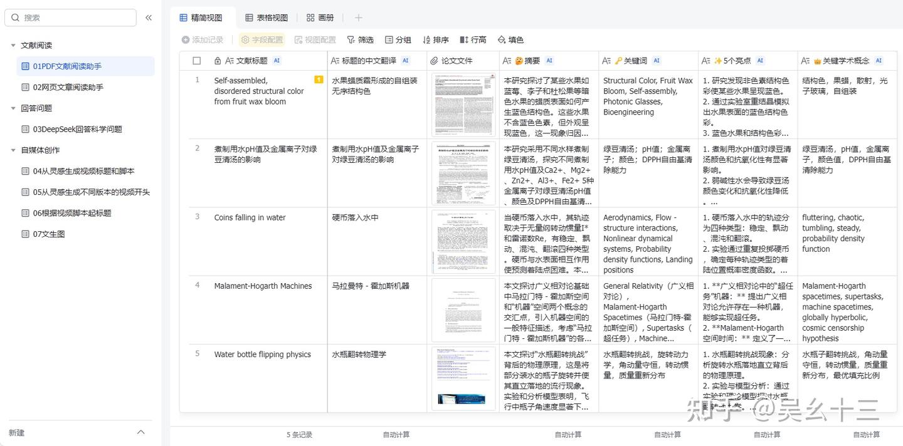
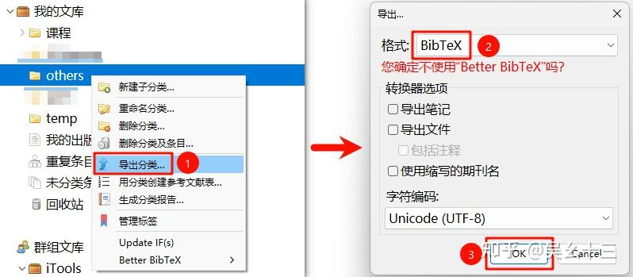
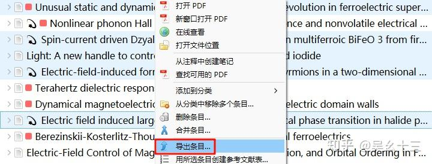
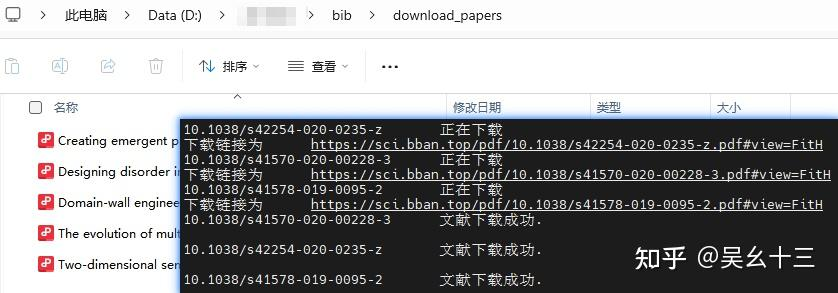
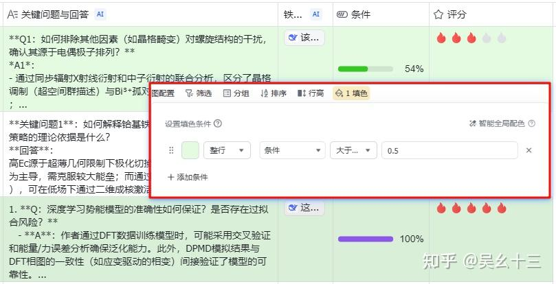

# 📚 AI批量文献阅读：毕导飞书版本 | AI Batch Paper Reading

[](https://a39htj6p8o.feishu.cn/base/QyK7bzmcVak97ms4fqJcKXxanvm)
[](https://www.zotero.org/)
[](https://www.python.org/)


> ✨ 前不久毕导共享了一个飞书多维表格模板，结合AI能力实现文献的自动化阅读与信息提取，比传统独立网站的AI文献阅读效率更高，且具备Excel表格的灵活管理优势。该飞书表格的具体介绍内容可以看毕导公众号发的内容：https://mp.weixin.qq.com/s/YDjeLcD4RriuIyb9QzCbZQ

---

## 🎯 核心优势

**相比于Zotero，其表格性质还是使该方法有其特别的优势**，仅需通过飞书表格插件批量上传pdf后，其就可以自动计算各列已经设置好的内容并输出。



---

## 🤔 问题背景

问题在于，现在大家都在用别的文献管理软件，比如Zotero，**如何把文献批量地导出并放进飞书表格中？** 以下只针对Zotero进行步骤展示，其余文献管理软件步骤类似。

---

## 📝 实施步骤

### 🚀 步骤1：导出BibTex

批量获取文献的BibTex并保存为文件。可以直接如下图选中文件夹导出BibTex，也可以选中某文件夹中(需要导出)的部分文献条目然后右键导出。(别的文献管理软件我不熟) **反正只需要获得一个BibTex文件即可**，很多文献网站也是可以直接获得这个文件的。





<div class="box-tip" markdown="1">

**💡 Zotero用户必看：** 建议在导出前，对所有文献进行下述操作：**批量选中文献后右键→Manage DOIs→Get long DOIs**。通过该操作获得准确且不为空的DOI，btw，Manage DOIs是Zotero的一个插件，具体安装过程请移步我的另一篇文章：[整合 | Zotero文献管理工具配置手册(治愈强迫症)](https://zhuanlan.zhihu.com/p/371968761)

</div>


---

### 🔍 步骤2：提取DOI与标题

假设步骤1中保存的BibTex文件名为 `test.bib`，则请运行下述代码文件 `grep_doi_title.py`，（**将test.bib和grep_doi_title.py放在同一文件夹/目录中**）命令行形式如下：

```bash
python grep_doi_title.py test.bib
```

运行完成后会获得一个名为 `output_title_doi.txt` 的文件，其内容为：第一列是doi，第二列是文章标题，每一行为一篇文献信息。

> ⚠️ **注意：** 目前该代码不能保证DOI、标题中存在乱码或中文时顺利运行，如需改进，可以咨询世界上最好的DeepSeek。🤖

```python
import re
import sys

def extract_title_and_doi(bib_file_path, output_file_path):
    try:
        with open(bib_file_path, 'r', encoding='utf-8') as file:
            content = file.read()

        # 使用正则表达式提取标题和 DOI
        entries = re.split(r'@[\w]+\{', content)[1:]  # 分割出条目
        results = []

        for entry in entries:
            # 提取标题
            title_match = re.search(r'title\s*=\s*{([^{}]+)}', entry, re.IGNORECASE)
            title = title_match.group(1).strip() if title_match else "No Title Found"

            # 提取 DOI
            doi_match = re.search(r'(doi|DOI|Doi)\s*=\s*{\s*(.*?)\s*}', entry, re.IGNORECASE)
            doi = doi_match.group(2).strip() if doi_match else "No DOI Found"

            results.append((title, doi))

        # 写入结果到输出文件
        with open(output_file_path, 'w', encoding='utf-8') as out_file:
            for title, doi in results:
                #out_file.write(f"{title} DOI: {doi}\n")
                out_file.write(f"{doi} {title}\n")

        print(f"成功提取 {len(results)} 个条目的标题和 DOI，并已保存到 {output_file_path}")

    except FileNotFoundError:
        print(f"错误: 找不到文件 '{bib_file_path}'。")
    except Exception as e:
        print(f"处理文件时发生错误: {e}")

if __name__ == "__main__":
    if len(sys.argv) != 2:
        print("用法: python test.py <input_bib_file>")
        sys.exit(1)

    input_bib_file = sys.argv[1]
    output_file = "output_title_doi.txt"  # 默认输出文件名，可自行修改

    extract_title_and_doi(input_bib_file, output_file)
```

---

### ⬇️ 步骤3：批量下载PDF

假设步骤2中获得的输出文件名为 `output_title_doi.txt`，则请运行下述代码文件 `download_pdf.py`，（**将output_title_doi.txt和download_pdf.py放在同一文件夹/目录中**）命令行形式如下：

```bash
python download_pdf.py
```

等待一段时间后，即可检查文件下载情况。下载的具体情况被记录在下述日志文件中：
- 📄 `download_log.txt` - 下载成功/失败的详细日志
- 📄 `failed_dois.txt` - 下载失败的DOI列表



```python
import requests
from bs4 import BeautifulSoup
import os
import threading
import pandas as pd
import re
from queue import Queue

# 清理文件名中的非法字符
def clean_filename(title):
    illegal_chars = r'[\\/:*?"<>|]'
    return re.sub(illegal_chars, '', title)

# 下载文献的函数
def download_paper(doi_title_queue, success_log, error_log, failed_dois, sci_hub_domains, head, download_folder):
    while not doi_title_queue.empty():
        doi, title = doi_title_queue.get()  # 从队列中获取 DOI 和标题

        if not doi:  # 如果 DOI 为空
            error_log.append(f"{title}\t没有 DOI。\n")  # 记录没有 DOI 的文献
            failed_dois.append((title, 'No DOI'))  # 将没有 DOI 的文献标题和说明记录到 failed_dois 中
            doi_title_queue.task_done()  # 任务完成
            continue  # 跳过这篇文献

        download_url = None
        for domain in sci_hub_domains:
            url = domain + doi + "#"
            try:
                r = requests.get(url, headers=head, timeout=15)
                r.raise_for_status()
                soup = BeautifulSoup(r.text, "html.parser")

                if soup.iframe is None and soup.embed:
                    download_url = "https:" + soup.embed.attrs.get("src", "")
                elif soup.iframe:
                    download_url = soup.iframe.attrs.get("src", "")

                if download_url:
                    print(f"{doi}\t正在下载\n下载链接为\t" + download_url)
                    download_r = requests.get(download_url, headers=head, timeout=15)
                    download_r.raise_for_status()

                    file_name = clean_filename(title) + ".pdf"
                    file_path = os.path.join(download_folder, file_name)
                    with open(file_path, "wb+") as temp:
                        temp.write(download_r.content)

                    success_log.append(f"{doi}\t下载成功.\n")
                    print(f"{doi}\t文献下载成功.\n")
                    break

            except requests.exceptions.RequestException as e:
                error_log.append(f"{doi}\t下载失败! 错误信息: {str(e)}\n")
                continue

        if not download_url:
            error_log.append(f"{doi}\t下载失败! 无法从任何Sci-Hub域名获取文献.\n")
            failed_dois.append((title, doi))  # 将失败的文献标题和 DOI 记录到 failed_dois 中
        doi_title_queue.task_done()

def main():
    # 配置变量
    download_folder = './download_papers/' # 默认输出文件夹，可自行修改
    sci_hub_domains = [
        "https://www.sci-hub.ren/",
        "https://sci-hub.hk/",
        "https://sci-hub.se/",
        "https://sci-hub.st/",
        "https://sci-hub.la/",
        "https://sci-hub.cat/",
        "https://sci-hub.ee/",
        "https://www.tesble.com/"
    ]
    head = {
        "user-agent": "Mozilla/5.0 (Windows NT 10.0; Win64; x64) AppleWebKit/537.36 (KHTML, like Gecko) Chrome/79.0.3945.117 Safari/537.36"
    }
    num_threads = 5

    # 创建保存下载文件的文件夹
    if not os.path.exists(download_folder):
        os.makedirs(download_folder)

    # 读取文本文件并提取 DOI 和 Title
    doi_list = []
    titles = []
    with open("output_title_doi.txt", "r") as f:   # 默认输入文件，可自行修改
        for line in f:
            line = line.strip()  # 去除首尾空白字符
            if not line:
                continue

            # 按第一个空格分割：第一列为 DOI，剩余部分为 Title
            parts = line.split(" ", 1)  # 分割 1 次（保留标题中的空格）
            if len(parts) == 2:
                doi, title = parts
                doi_list.append(doi)
                titles.append(title)
            else:
                print(f"格式错误：忽略无法解析的行 -> {line}")

    # 创建一个线程安全的队列
    doi_title_queue = Queue()

    # 将 DOI 和标题一一对应地放入队列中
    for doi, title in zip(doi_list, titles):
        doi_title_queue.put((doi, title))

    # 成功与失败的记录
    success_log = []
    error_log = []
    failed_dois = []  # 使用列表来存储失败的 DOI 和文献标题

    # 启动多线程下载文献
    threads = []
    for _ in range(num_threads):
        t = threading.Thread(target=download_paper, args=(
        doi_title_queue, success_log, error_log, failed_dois, sci_hub_domains, head, download_folder))
        threads.append(t)

    # 启动所有线程
    for t in threads:
        t.start()

    # 等待所有线程完成
    for t in threads:
        t.join()

    # 记录成功和失败的日志
    with open(os.path.join("./download_log.txt"), "w", encoding="utf-8") as log_file:
        log_file.write("成功下载的DOI：\n")
        log_file.writelines(success_log)
        log_file.write("\n下载失败的DOI：\n")
        log_file.writelines(error_log)

    # 输出下载失败的文献（包括没有 DOI 的文献）
    with open(os.path.join("./failed_dois.txt"), "w", encoding="utf-8") as failed_file:
        failed_file.write("以下DOI下载失败，请手动检查资源：\n")
        for title, doi in failed_dois:
            if doi == 'No DOI':
                failed_file.write(f"{title}\t没有 DOI\n")  # 没有 DOI 的文献
            else:
                failed_file.write(f"{title}\t{doi}\n")  # 有 DOI 但下载失败的文献

    print("所有任务完成！")

if __name__ == '__main__':
    main()
```

---

### 📤 步骤4：上传至飞书

打开飞书模板，批量将步骤3中下载好的PDF上传到"论文文件"这一列。上传完成后即可坐享其成。🎉


---

### 🤔 步骤5：添加进度列

熟悉使用该表格后，可根据自己需求添加不同功能的列，比如DeepSeek的各种分析、个人对文章的评分、阅读理解的进度。当有了进度这一列之后，根据自己的阅读理解程度，拖动进度条，然后设置表格自动填色（设置填色条件），如果进度条大于50%，填色，代表这篇文章大概是读过了理解了。




---
## 📋 文件结构

```
📁 your_project/
├── 📄 test.bib                    # 步骤1：Zotero导出的BibTex文件
├── 🐍 grep_doi_title.py           # 步骤2：提取DOI和标题的脚本
├── 📄 output_title_doi.txt        # 步骤2：生成的DOI-标题对照表
├── 🐍 download_pdf.py             # 步骤3：批量下载PDF的脚本
├── 📁 download_papers/            # 步骤3：下载的PDF文件存放目录
├── 📄 download_log.txt            # 步骤3：下载日志
└── 📄 failed_dois.txt             # 步骤3：下载失败的DOI列表
```

---

## ⚠️ 免责声明

本教程仅供学术交流使用，请遵守相关文献数据库的使用条款和版权法规。

此外，在使用python爬取文献时，请确保遵守相关网站的robots.txt规则，避免对网站造成过大负担。

目前，有些文献数据库可能会对批量爬取行为进行限制，建议在合理范围内操作。

至少，PRL在使用上述方法后不久，就增加了人类识别验证码，导致无法批量下载文献。